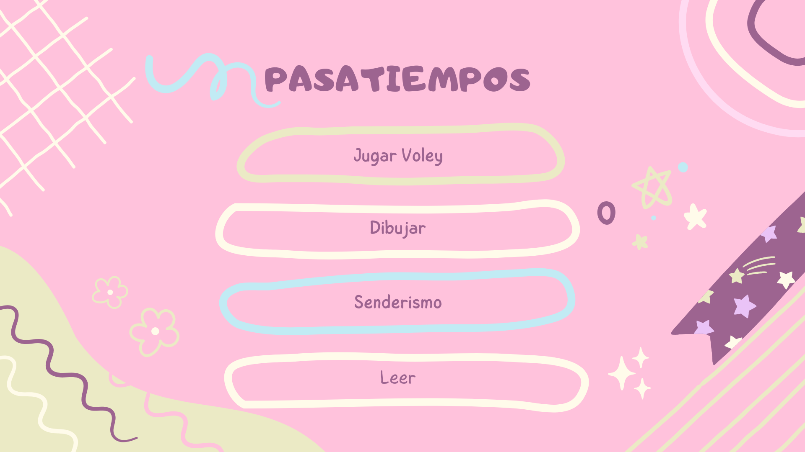
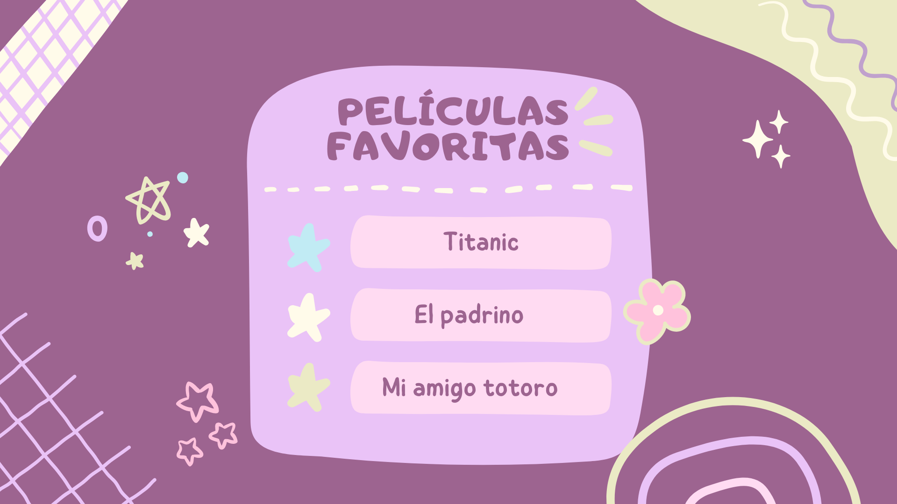

# FUNBIO1
Este es un proyecto que incluen imagenes
##Imagenes
Aqui esta la imagen de ejemplo

Otra imagen 

Otra imagen

Otra imagen

Otra imagen

git add README.md
git commit -m "Corregido README.md con imágenes"
git push origin main

